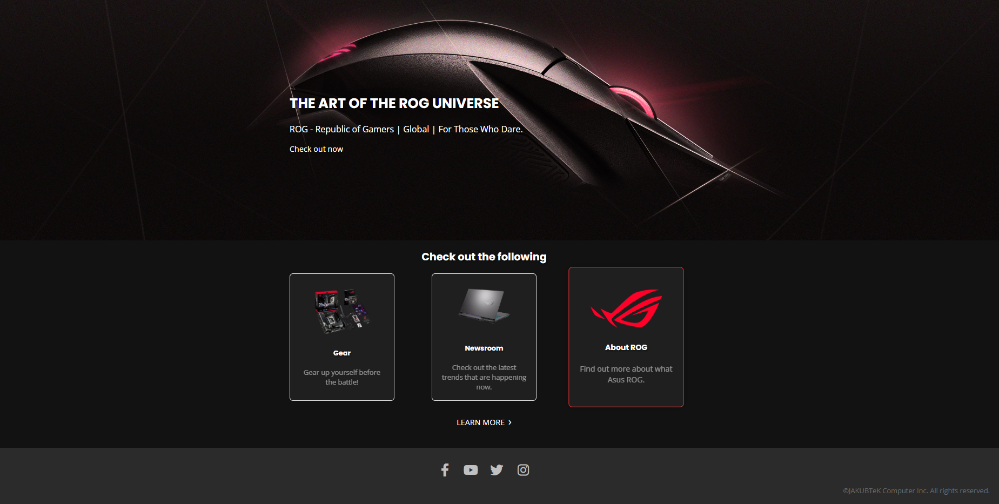

# 🚀 ASUS Gaming ROG Landing Page

Welcome to the ASUS Gaming ROG landing page! This dynamic page is themed around the Republic of Gamers (ROG) and offers an engaging experience with interactive sections and modern visuals. 🎮

This project features a hero/banner section, a “How It Works” area with informational cards, and a footer with social media links and copyright details. Designed to capture the essence of ASUS ROG, this landing page offers an appealing, user-friendly interface. 🌟

## 🎨 Key Features
- **Hero/Banner Section**: The banner features a background image, heading, description, and a CTA button that links to the official ASUS ROG website, making it the focal point of the page.
- **How It Works Section**: This section highlights key areas like gear, news, and information about ASUS ROG using three interactive cards. These are responsively arranged using flexbox for all screen sizes.
- **Interactive “Learn More” Button**: A button with a dynamic gradient underline and a subtle arrow hover effect for a smooth, interactive user experience.
- **Footer**: Includes social media links using FontAwesome icons and a copyright notice styled with custom CSS.

## ⚙️ Technologies Used
- **HTML5**: Structured the page with semantic HTML elements and organized the layout using `div` containers.
- **CSS3**: Used custom CSS for styling, including hover states, gradients, flexbox for layout, and animations/transitions for interactivity.
- **FontAwesome**: Incorporated icons for social media links and other visual elements in the footer.
- **Responsive Design**: Applied media queries to ensure the layout adapts well to different screen sizes, providing a mobile-friendly experience.

## 💡 Styling & Interactivity
- **CSS Transitions**: Smooth hover effects for buttons and card scaling.
- **Custom Styling**: Styled the button and arrow to match the ASUS ROG aesthetic, emphasizing the brand's color scheme and modern, sleek design.
- **Flexbox Layout**: Ensured dynamic and responsive placement of elements, including the cards and the “Learn More” button.

Now, the ASUS Gaming ROG landing page offers a visually appealing, user-centered experience with smooth animations and a responsive design, capturing the spirit of ASUS ROG. 🚀

## 📸 Screenshot

Here’s a preview of the landing page:

